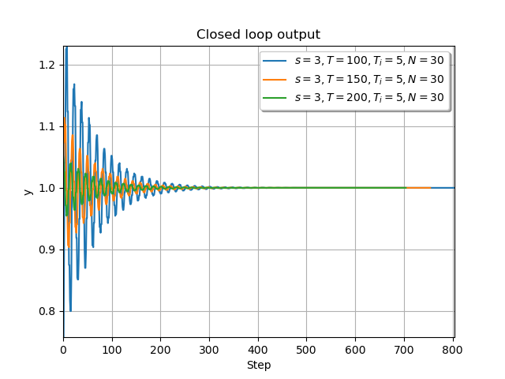

# PyDeePC

Python library that implements DeePC: Data-Enabled Predictive Control.

_Original paper_: [Data-Enabled Predictive Control: In the Shallows of the DeePC](https://arxiv.org/pdf/1811.05890.pdf)\
_Library Author_: Alessio Russo (PhD Student at KTH - alessior@kth.se)\
_License_: MIT



DeePC applied to a 3-pulley system with transfer function 
```math
T(z) = \frac{0.28z+0.51}{z^4-1.42z^3 +1.59z^2 -1.32z+0.89}
```
with sampling time Ts=0.05 [s]. Check the file in `examples\example.py` for more information.

## Requirements

- Python 3.7
- Numpy, Scipy, Cvxpy

## Installation

Use the `setup.py` file to install the library (execute the command `pip install .`)

## Usage/Examples

To learn how to use the library, check the examples located in the `examples/` folder.

In general the code has the following structure

```python
import numpy as np
import cvxpy as cp

from typing import List
from cvxpy.expressions.expression import Expression
from cvxpy.constraints.constraint import Constraint
from pydeepc import DeePC
from pydeepc.utils import Data

# Define the loss function for DeePC
def loss_callback(u: cp.Variable, y: cp.Variable) -> Expression:
    horizon, M, P = u.shape[0], u.shape[1], y.shape[1]
    ref = 1
    # Sum_t ||y_t - r_t||^2
    return cp.sum(cp.norm(y - ref, p=2, axis=1))  # cp.sum(cp.norm(u, p=2, axis=1))

# Define the constraints for DeePC
def constraints_callback(u: cp.Variable, y: cp.Variable) -> List[Constraint]:
    horizon, M, P = u.shape[0], u.shape[1], y.shape[1]
    # Define a list of input/output constraints
    return [y <= 10, y >= -10, u >= -20, u <= 20]

# DeePC paramters
s = 3                       # How many steps before we solve again the DeePC problem
T_INI = 5                   # Size of the initial set of data
T = 200                     # Number of data points used to estimate the system
HORIZON = 30                # Horizon length
LAMBDA_G_REGULARIZER = 0    # g regularizer (see DeePC paper, eq. 8)
LAMBDA_Y_REGULARIZER = 0    # y regularizer (see DeePC paper, eq. 8)

# Define plant
sys = ...

# Generate initial data and initialize DeePC
u = ... # define input data of length T
y = ... # apply input to system and measure output
data = Data(u, y)
deepc = DeePC(data, Tini = T_INI, horizon = HORIZON)

# Simulate for a number of steps
for idx in range(300):
    # Solve DeePC
    u_optimal, info = deepc.solve_deepc(
        data_ini = data_ini,
        build_loss = loss_callback,
        build_constraints = constraints_callback,
        lambda_g = LAMBDA_G_REGULARIZER,
        lambda_y = LAMBDA_Y_REGULARIZER)

    output = ... # Apply optimal control input of size s to the system and measure output
    data_ini = Data(..., ...) # Use last T_INI samples to build a new initial condition
```

## TODO

- Add tests
- Add stochastic system example

## License

Our code is released under the MIT license

[](https://opensource.org/licenses/MIT)
